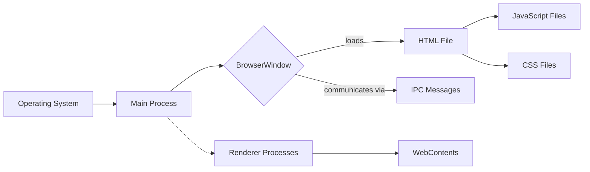

---
{"tags":["Electron"],"date_created":"2024-02-05","date_modified":"2024-02-05","tistoryBlogName":"berom","tistoryTitle":"Electron에서 TypeScript 경로 별칭 설정하기","tistoryTags":"개발/Electron","tistoryVisibility":"3","tistoryCategory":"1071006","tistorySkipModal":true,"tistoryPostId":"567","tistoryPostUrl":"https://berom.tistory.com/567","dg-publish":true,"up":"[[전체 화면 드래그 캡처 기능 개선을 위한 Electron 활용]]","permalink":"/encounters/electron-type-script/","dgPassFrontmatter":true,"noteIcon":"1","created":"2024-02-05T18:15:58.457+09:00","updated":"2024-03-16T19:23:19.596+09:00"}
---

# Electron에서 TypeScript 경로 별칭 설정하기: `module-alias`를 사용한 실전 가이드



Electron과 TypeScript를 함께 사용하면 개발자는 강력한 타입 시스템과 함께 풍부한 API를 활용하여 데스크탑 애플리케이션을 개발할 수 있습니다. 그러나 프로젝트의 규모가 커지면서 파일 구조가 복잡해지고, 상대 경로를 사용하는 것만으로는 모듈을 관리하기 어려워질 수 있습니다. 이때, TypeScript의 `paths` 설정과 `module-alias` 패키지를 사용하여 이 문제를 깔끔하게 해결할 수 있습니다. 본 가이드는 TypeScript에서 설정한 경로 별칭을 Electron 애플리케이션의 런타임에서도 정확하게 해석할 수 있도록 설정하는 방법을 설명합니다.

## 시작하기 전에

본 가이드를 따라하기 전에, `module-alias` 패키지가 설치되어 있어야 합니다. 설치되지 않았다면, 다음 명령어로 설치할 수 있습니다.

```bash
npm install --save module-alias
```

## TypeScript `paths` 설정하기

1. **`tsconfig.json` 수정:** 프로젝트의 루트에 위치한 `tsconfig.json` 파일을 열고, `compilerOptions` 섹션에 `paths` 설정을 추가합니다. 이 설정은 TypeScript 컴파일러에게 지정된 별칭을 사용하여 모듈을 찾을 수 있게 알려줍니다. 예를 들어:

    ```json
    "paths": {
      "@main/*": ["src/main/*"],
      "@render/*": ["src/render/*"],
      "@common/*": ["src/common/*"]
    }
    ```

2. **`package.json`에 별칭 설정 추가:** 런타임에 해석될 경로 별칭을 `package.json`에도 추가합니다. 이는 `module-alias` 패키지가 런타임에서 별칭을 실제 경로로 매핑하는 데 사용됩니다.

    ```json
    "_moduleAliases": {
      "@src": "dist/modules"
    }
    ```

## Electron `main.ts` 파일 설정

Electron 애플리케이션의 진입점인 `main.ts` 파일에서 `module-alias/register`를 import하여, 런타임에도 TypeScript의 경로 별칭이 올바르게 해석될 수 있도록 합니다.
```typescript
import 'module-alias/register';
import { app, BrowserWindow, ipcMain } from "electron";
// 메인 윈도우 생성 및 기타 애플리케이션 로직 구현
```

## 이해: TypeScript에서 Electron으로의 실행 흐름

Electron 애플리케이션에서 TypeScript를 사용할 때, 실행 흐름을 명확하고 절차 지향적으로 이해하는 것이 중요합니다. 이 과정은 기본적으로 두 주요 단계로 구분됩니다
- TypeScript 파일의 컴파일 과정
- Electron에 의한 컴파일된 JavaScript 파일의 실행 과정
### 1. TypeScript 파일의 컴파일

- **단계 1:** TypeScript 소스 코드 작성 - 개발자는 Electron 애플리케이션의 기능을 구현하기 위해 TypeScript(.ts) 파일을 작성합니다. 이 과정에서, 코드의 모듈화와 재사용성을 높이기 위해 TypeScript의 `paths` 별칭 기능을 활용할 수 있습니다.

- **단계 2:** `tsconfig.json` 설정 - 프로젝트의 루트 디렉토리에 위치한 `tsconfig.json` 파일에서, `compilerOptions`에 `paths`를 포함하여 별칭을 설정합니다. 이 설정은 컴파일러에게 모듈의 위치를 지정하는 역할을 합니다.

- **단계 3:** TypeScript 컴파일 - TypeScript 컴파일러(`tsc`)를 사용하여 `.ts` 파일을 `.js` 파일로 컴파일합니다. 이 과정에서 `tsconfig.json`의 설정이 적용되며, 하지만 `paths` 별칭은 컴파일된 `.js` 파일에 직접적으로 반영되지 않습니다.

### 2. Electron에 의한 JavaScript 파일의 실행

- **단계 4:** `module-alias` 설정 - 컴파일 과정에서 생성된 JavaScript 파일이 Electron의 런타임 환경에서 별칭을 인식할 수 있도록 하기 위해, `module-alias` 패키지를 사용합니다. 이를 위해, 먼저 `npm install module-alias --save` 명령어로 패키지를 설치합니다.

- **단계 5:** `package.json`에 별칭 설정 추가 - `module-alias`가 별칭을 실제 경로로 매핑할 수 있도록, `package.json`에 `_moduleAliases` 항목을 추가하고, 컴파일된 `.js` 파일의 경로를 지정합니다.

- **단계 6:** 별칭 해석을 위한 초기화 - Electron 애플리케이션의 진입점 JavaScript 파일(일반적으로 `main.js` 또는 `index.js`)에서 `require('module-alias/register')`를 호출하여, 애플리케이션 실행 시 `module-alias`가 초기화되도록 합니다.

- **단계 7:** Electron 애플리케이션 실행 - 이제 Electron 애플리케이션을 실행할 때, `module-alias`를 통해 설정된 별칭이 올바르게 해석되어, 모듈 로딩 오류 없이 애플리케이션을 실행할 수 있습니다.

## 결론

`module-alias`와 TypeScript의 `paths` 설정을 사용하면, Electron 애플리케이션에서 모듈 경로 관리를 효율적으로 할 수 있습니다. 이 방법을 통해, 개발자는 코드의 가독성을 높이고, 유지 보수를 용이하게 할 수 있습니다. 복잡한 애플리케이션 구조에서도 모듈을 쉽게 관리하고, 실행 시점에서의 오류 없이 애플리케이션을 안정적으로 운영할 수 있게 됩니다.