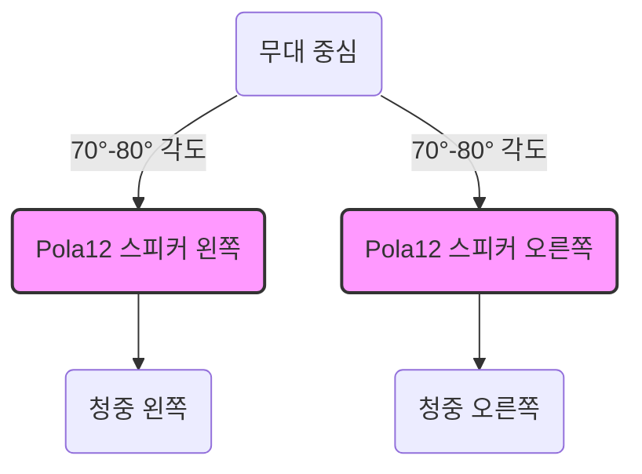
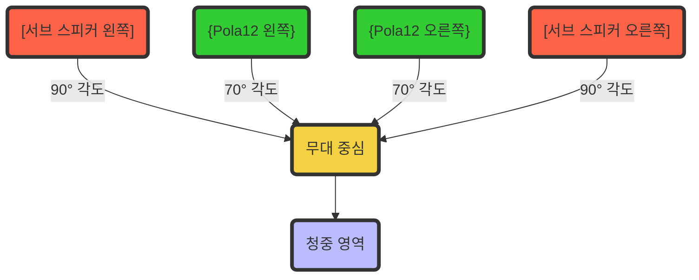

---
{"tags":null,"aliases":null,"link":null,"up":null,"persona":null,"index":null,"date_created":"2024-02-01","date_modified":"2024-02-01","tistoryBlogName":"berom","tistoryTitle":"광주 지구 CCC PA 구성","tistoryVisibility":3,"tistoryCategory":1094205,"tistorySkipModal":true,"tistoryPostId":562,"tistoryPostUrl":"https://berom.tistory.com/562","dg-publish":true,"permalink":"/encounters/ccc-pa/","dgPassFrontmatter":true,"noteIcon":"1","created":"2024-02-01T15:12:48.036+09:00","updated":"2024-02-01T17:17:32.286+09:00"}
---

# 광주 지구 CCC PA 구성

1. **부채꼴 모양 스테이지에서 스피커의 위치**:
	- 메인 스피커(L/R)는 청중 지역의 전면에 중앙에 위치해야 합니다.
	- Pola12의 120° x 30°의 호른 특성을 고려
		- 이 스피커들은 청중 지역을 균일하게 커버할 수 있도록 조정
	- 서브 스피커(L/R)는 메인 스피커와 함께 작동하여 부채꼴 모양의 청중 지역의 측면을 커버해야 함
		- 이들은 메인 스피커의 저주파 응답을 보강하기 위해 주로 사용되며, 메인 스피커에서 생성되지 않는 저주파 영역을 채우는 역할을 합니다.

2. **메인 스피커만 켜고 소리 크기 선정, 허니 존 영역 내로 맞춤**:
   - Pola12의 최대 SPL은 127 dB로, 이 수치를 기반으로 메인 스피커의 레벨을 설정합니다.
   - 청중의 '허니 존'(가장 이상적인 청취 영역)에 대한 SPL을 측정하여, 균일한 음향 커버리지를 제공하는 것이 중요

3. **메인 스피커 홀 튜닝**:
	- 메인 스피커의 응답을 홀의 음향적 특성에 맞추기 위해 EQ와 시간 정렬을 조정
	- Pola12의 주파수 응답(35 Hz–20 kHz)을 고려하여, 특히 저주파와 고주파 영역에서 필요한 조정

4. **메인 스피커 켜둔 상태에서 서브 스피커 켜고 소리 크기 조율**:
	- 서브 스피커의 레벨은 메인 스피커와의 균형을 맞추기 위해 조심스럽게 조정됩니다.
	- 서브 스피커는 메인 스피커에서 충분히 커버되지 않는 저주파를 강화하는 역할을 합니다.
	- 크로스오버 포인트를 정확히 설정하여 두 스피커 시스템 간의 부드러운 전환을 보장해야 합니다.

5. **서브 스피커 홀 튜닝**:
	- 서브 스피커의 튜닝은 메인 스피커와의 음향적 일관성을 유지하면서 진행됩니다.
	- 서브 스피커의 포지셔닝과 크로스오버 설정은 메인 스피커와의 연계를 고려하여 조정되어야 합니다.

## Speaker 배치
> 각 스피커 위치는 현장 상황에 따라 바뀔 수 있음
### Main Speaker

### Sub Speaker

# Output 및 공간 구성
## 스피커 배치
- **위치**: 부채꼴 모양 스테이지에서 메인 스피커(L/R)와 서브 스피커(L/R)의 최적 위치 결정
- **목표**: 서브 스피커는 메인 스피커의 저주파 응답을 보강하는 역할을 하며, 스테이지 양쪽에서 청중 지역을 균일하게 커버해야 함

## 소리 크기 및 튜닝
1. **메인 스피커 볼륨 설정**
	- 메인 스피커만 작동시키고, 청중 영역 내 '허니 존'에 이상적인 볼륨 수준을 맞춤
2. **메인 스피커 홀 튜닝**
	- 홀의 음향적 특성에 따라 메인 스피커의 EQ 및 시간 정렬 조정
3. **서브 스피커 볼륨 조율**
	- 메인 스피커를 켜둔 상태에서 서브 스피커의 볼륨을 조절하여 메인과의 균형 맞춤
4. **서브 스피커 홀 튜닝**
	- 메인 스피커와의 음향적 일관성을 고려하여 서브 스피커 튜닝

## Pola12 스피커 시스템 특성
- **Frequency Response**: 35 Hz–20 kHz
- **Power Amplifier Output**: 2000 W
- **Bluetooth**: Version 5.0
- **Housing**: Birch multiplex/ABS
- **Mixer Inputs**: 2 x Mic/Line, 1 x Instrument, 1 x Aux/Bluetooth
- **Total Height**: 218 cm
- **Weight**: 28 kg
- **Horn Characteristics**: 120° x 30°

### Pola12 System Details
- **Max. SPL Peak**: 127 dB (half space)
- **Frequency Response**: +/10 dB 35 - 20 kHz
- **Amplifier Output**: 2000 W
- **Subwoofer**: 1 x 12" with 2.5" voice coil
- **Subwoofer Dimensions (WxHxD)**: 36.6 x 67.5 x 54.1 cm; **Weight**: 22.1 kg
- **Mid/High Unit**: 6 x 3" mid speakers with ¾" voice coil, neodymium; 1 x 1" HF driver with 1" voice coil
- **Mid/High Unit Dimensions (WxHxD)**: 10.8 x 82.5 x 9.8 cm; **Weight**: 3.9 kg

