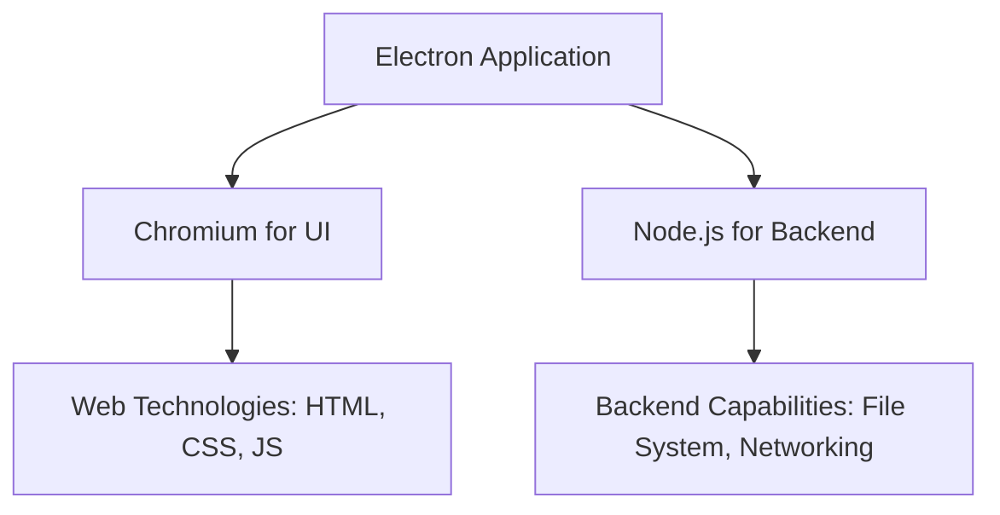

---
{"related":null,"tags":["Electron","Framework","Programming","CrossPlatform","WebTechnologies","개발/프로젝트"],"aliases":"일렉트론,⚙️ Electron","link":null,"up":null,"persona":null,"index":null,"date_created":"2023-12-30","date_modified":"2024-03-16","dg-publish":true,"dg-path":"MOC/Electron.md","permalink":"/moc/electron/","dgPassFrontmatter":true,"noteIcon":"1","created":"2023-12-30T23:43:50.295+09:00","updated":"2024-03-16T19:38:32.320+09:00"}
---

# ⚙️ Electron

- 철학 : 웹 기반 데스톱 프레임워크 → 웹 기술 기반 크로스 플랫폼 데스크톱 프레임워크

- [Electron의 기원](https://www.electronjs.org/blog/10-years-of-electron) : 웹 개발자들이 데스크탑 애플리케이션을 쉽고 효율적으로 개발할 수 있게 하는 것

- ## 핵심 특징
	- **크로스 플랫폼 지원**: Windows, macOS, Linux 등 다양한 운영 체제에서 실행됩니다.
	- **웹 기술 사용**: 웹 개발자가 익숙한 기술을 사용하여 데스크탑 앱을 개발할 수 있습니다.
	- **[[Efforts/Notes/수업/Node.js\|Node.js]] 통합**: Node.js의 기능을 활용하여 데스크탑 애플리케이션에서도 서버 사이드 코드를 실행 가능

- ## 작동 방식
	- **메인 프로세스와 렌더러 프로세스**
		- Electron은 메인 프로세스와 여러 렌더러 프로세스로 구성
		- 메인 프로세스는 애플리케이션의 생명주기를 관리하고, 렌더러 프로세스는 웹 페이지를 표시
	- [[+ Encounters/Electron에서의 메인 프로세스와 렌더러 프로세스 간 통신\|Electron에서의 메인 프로세스와 렌더러 프로세스 간 통신]]

- ## 개발 환경
	- **[[Chromium\|Chromium]]**: 렌더러 프로세스는 Chromium(웹 브라우저 엔진)을 기반으로 동작합니다.
	- **[[Efforts/Notes/수업/Node.js\|Node.js]]**: 백엔드 로직을 작성하기 위해 Node.js 환경을 제공합니다.

## 렌더러 프로세스
### [[Atlas/MAPS/⚙️ React\|⚙️ React]]
- [[Electron 앱과 React에서 발생하는 `undefined` 문제 해결기]]
- [[+ Encounters/Electron 에서 HashRouter를 쓰는게 정신 건강에 좋은 이유,,\|Electron 에서 HashRouter를 쓰는게 정신 건강에 좋은 이유,,]]
	- [[+ Encounters/Why Using HashRouter in Electron is a Win for Your Sanity\|Why Using HashRouter in Electron is a Win for Your Sanity]]
- [[+ Encounters/Electron 앱에서 개발 환경이 아닐 때 빌드된 React 페이지 로드하는 방법\|Electron 앱에서 개발 환경이 아닐 때 빌드된 React 페이지 로드하는 방법]]
- [[+ Encounters/Electron에 React 붙이기\|Electron에 React 붙이기]]
- [[+ Encounters/Electron 프로젝트 마이그레이션 가이드 - Create React App에서 Vite\|Electron 프로젝트 마이그레이션 가이드 - Create React App에서 Vite]]
- [[+ Encounters/Electron TSX Production 환경에서 윈도우에 로딩이 되지 않는 문제 해결\|Electron TSX Production 환경에서 윈도우에 로딩이 되지 않는 문제 해결]]

## 라이브러리
- [[+ Encounters/electron-store\|electron-store]]
- [[+ Encounters/Electron Unplugin-auto-expose 사용 메뉴얼\|Electron Unplugin-auto-expose 사용 메뉴얼]]
- [[+ Encounters/electron-builder\|electron-builder]]
## 레퍼런스
- [Electron 한글 문서](https://tinydew4.gitbooks.io/electron-ko/content/?q=)
- [[+ Encounters/Crafting a Robust WindowManager in Electron Enhancing App Architecture\|Crafting a Robust WindowManager in Electron Enhancing App Architecture]]
- [[Atlas/Ideas/📜 Reddit - Has Anyone Successfully Monetized a Solo Developed Electron App?\|📜 Reddit - Has Anyone Successfully Monetized a Solo Developed Electron App?]]
- [[+ Encounters/Utilizing Electron for Precise Multi-Monitor Screen Capture A Guide to Accurate User Selection Area Capture\|Utilizing Electron for Precise Multi-Monitor Screen Capture A Guide to Accurate User Selection Area Capture]]
- [[+ Encounters/Communicating Between Main and Renderer Processes in Electron\|Communicating Between Main and Renderer Processes in Electron]]
- [[+ Encounters/Electron Cannot find module 'module-alias register'\|Electron Cannot find module 'module-alias register']]
- [[Efforts/Notes/DigitalCraft/Electron 앱 build 중 Application entry file 이슈 해결\|Electron 앱 build 중 Application entry file 이슈 해결]]
- [[+ Encounters/Electron 컴포넌트 link로 이동 시킨 후 캡처 안되는 이유\|Electron 컴포넌트 link로 이동 시킨 후 캡처 안되는 이유]]
- [[+ Encounters/Using System Clipboard in Electron A Guide from Berom's Tistory Blog\|Using System Clipboard in Electron A Guide from Berom's Tistory Blog]]
- [[+ Encounters/Understanding Window Creation for Each Page in Electron React Applications\|Understanding Window Creation for Each Page in Electron React Applications]]
- [[Efforts/Notes/DigitalCraft/Electron  개발환경에서 캡처가 되지 않았던 이유\|Electron  개발환경에서 캡처가 되지 않았던 이유]]
- [[Atlas/Ideas/Implementing Full Screen Capture Feature in PixelScriber Using Electron\|Implementing Full Screen Capture Feature in PixelScriber Using Electron]]
- [[Atlas/Ideas/Electron - Yarn 기반의 javascript 기본 설정과 파일 구성\|Electron - Yarn 기반의 javascript 기본 설정과 파일 구성]]
- [[+ Encounters/React 프로젝트가 로딩 되기 전에 Electron이 구동 되어 버릴 때 해결 방법\|React 프로젝트가 로딩 되기 전에 Electron이 구동 되어 버릴 때 해결 방법]]
- [[+ Encounters/Electron에서 TypeScript 경로 별칭 설정하기\|Electron에서 TypeScript 경로 별칭 설정하기]]
- [[+ Encounters/Electron Browser Window 숨기는 방법\|Electron Browser Window 숨기는 방법]]
- [[Efforts/Notes/DigitalCraft/Modification of Enabling Full Screen Capture through Dragging\|Modification of Enabling Full Screen Capture through Dragging]]
- [[+ Encounters/Electron - Can't resolve 'path’\|Electron - Can't resolve 'path’]]
- [[Atlas/Ideas/Electron Window Capture Method Making the Application Appear as a Window\|Electron Window Capture Method Making the Application Appear as a Window]]
- [[Atlas/Sources/web/📎  Electron 애플리케이션의 구조와 동작 원리\|📎  Electron 애플리케이션의 구조와 동작 원리]]

## Thinking
- [[Calendar/Daily Notes/2023-12-31\|2023-12-31]] 00:15 잠깐 튜토리얼 해봤는데 아주 재밌구나
- [[Calendar/Daily Notes/2024-01-04\|2024-01-04]] 09:52 이게 어떤 구조인지, [[V8 엔진\|V8 엔진]]과 [[Efforts/Notes/수업/Node.js\|Node.js]]가 어떻게 구성 되는지를 알고 싶다

